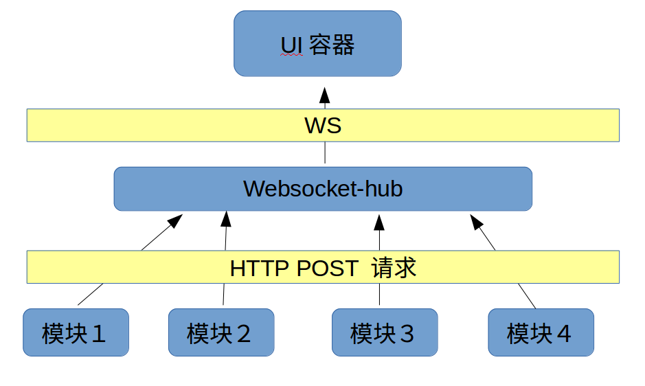

## websocker-hub
websocker-hub是一个在微服务架构中，用于集中管理多个web后端与web前端之间的websocker通讯,避免了多个web后端和一个前端之间需要建立多个websocker通道，避免了前端的资源开销。



## 技术栈

- `golang `
- `code.google.com/p/go.net/websocket`

## 构建并运行
```sh
go build 

./main --port=1234
```

## API
ws://127.0.0.1:1234/v1/socket/ws
curl 127.0.0.1:1234/v1/socket/notice -d '{"name":"test"}'
##

```js
var sock = null;
var wsuri = "ws://127.0.0.1:1234/v1/socket/ws"
window.onload = function () {
    console.log("window on load");
    sock = new WebSocket(wsuri);
    sock.onopen = function () {
        console.log("connected to " + wsuri);
    }
    sock.onclose = function (e) {
        console.log("connection close ", e.code)
    }
    sock.onmessage = function (e) {
        document.getElementById("message1").value = e.data
        console.log("message received : " + e.data)
    }
}

function send() {
    var msg = document.getElementById("message").value;
    sock.send(msg);
}
```